# Sparse SageAttention
This repository provides a Sparse Attention API based on [SageAttention](https://github.com/thu-ml/SageAttention) **V1**, which can compute attention with any block sparse pattern very fast.

## Installation
### Base Environment
* `python>=3.9`, `torch>=2.3.0`, `triton==3.0 / 3.1 / 3.2 / 3.4`
- For RTX 5090, please use `torch_nightly + triton 3.4.0+git5389ed79`

### Install Package
To use our Sparse_SageAttention, please:
```bash
# git clone ...
python setup.py install # or pip install -e .
```

## Usage
```python
from sparse_sageattn import sparse_sageattn
sparse_attn_output = sparse_sageattn(
        q, k, v,
        mask_id=None,     
        is_causal=False, 
        tensor_layout="HND")
```
* `q, k, v` are `FP16/BF16` dtype with the shape of `(batch_size, head_num, seqlen, head_dim)` when using the default `tenso_layout`
* `mask_id` is a **block mask** to specify whether corresponding block in the attention map should be calculated(**`1` for calculating and `0` for skipped**). The default value is `None`, which will perform full SageAttention V1. Currently we only support the block_size of (128, 64). For example, for an attention map(512x512) below, we can set `mask_id` as:

```python
mask_id = torch.tensor([
  [0, 1, 0, 1, 1, 1, 0, 1],
  [0, 1, 1, 1, 0, 0, 1, 0],
  [1, 0, 1, 1, 1, 0, 0, 1],
  [0, 0, 1, 0, 1, 1, 0, 0]
  ], device='cuda')
```
</div>
<div style="text-align: center;">
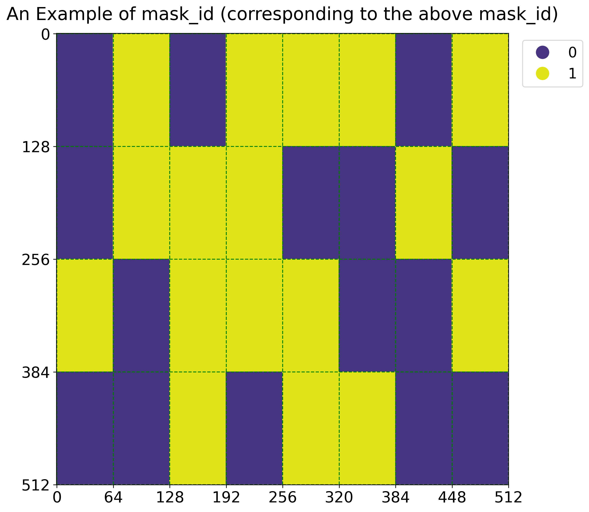
</div>

* `is_causal` to specify whether it is a causal attention or not, default is `False`.
* `tensor_layout` specify the layout of `q, k, v`:
  * for `q,k,v` with shape `(batch_size, head_num, seqlen, head_dim)` it should be `"HND"`.
  * for `q,k,v` with shape `(batch_size, seqlen, head_num, head_dim)` it should be `"NHD"`.

<!-- > **Note:**
currently only support `q,k,v` whose dtype is `FP16` -->

## Performance
We compare the TOPS of Sparse_SageAttention, [FlexAttention](url=https://pytorch.org/blog/flexattention/) and [FlashAttention2](url=https://github.com/Dao-AILab/flash-attention) under different sparsity on RTX 4090 and RTX 5090:


<div style="display: flex; flex-wrap: wrap; justify-content: center; gap: 20px; margin: 0 auto; max-width: 1200px;">
  <!-- 第一行 -->
  <div style="flex: 1 1 45%; min-width: 300px;">
    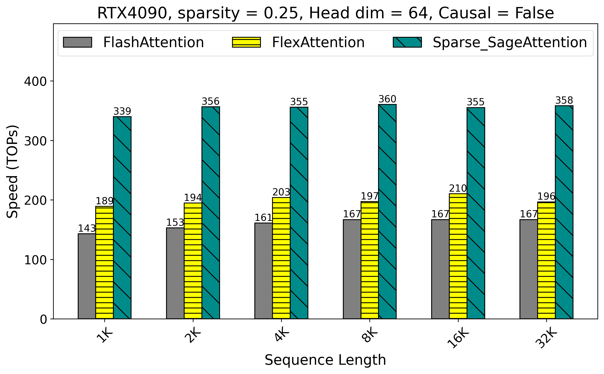
  </div>
  <div style="flex: 1 1 45%; min-width: 300px;">
    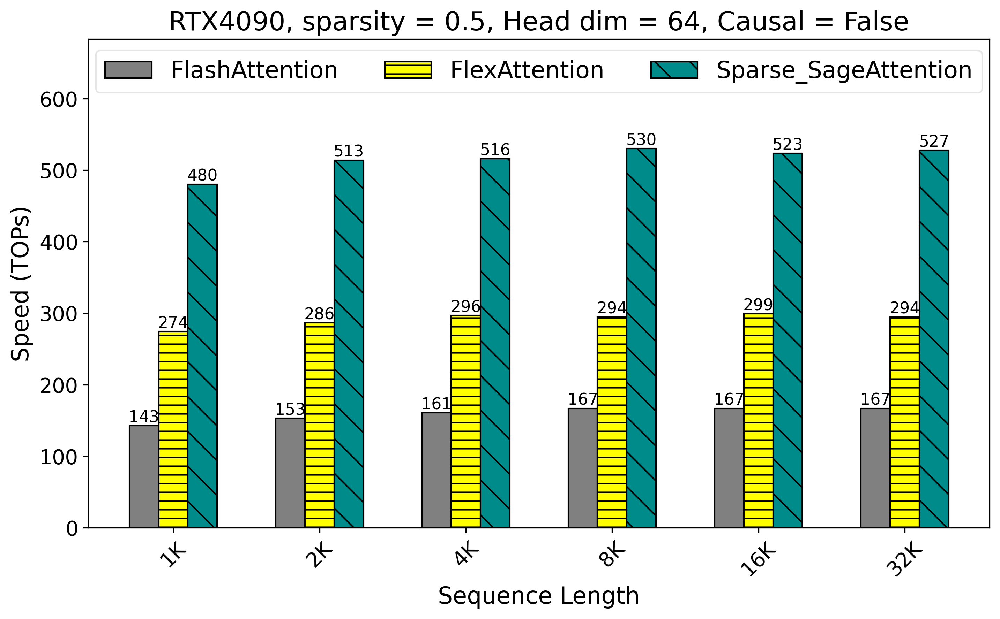
  </div>

  <!-- 第二行 -->
  <div style="flex: 1 1 45%; min-width: 300px;">
    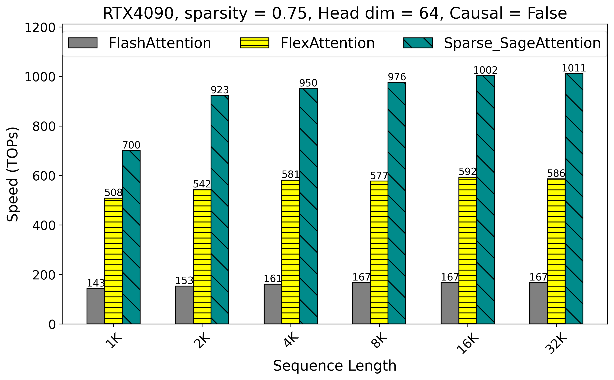
  </div>
  <div style="flex: 1 1 45%; min-width: 300px;">
    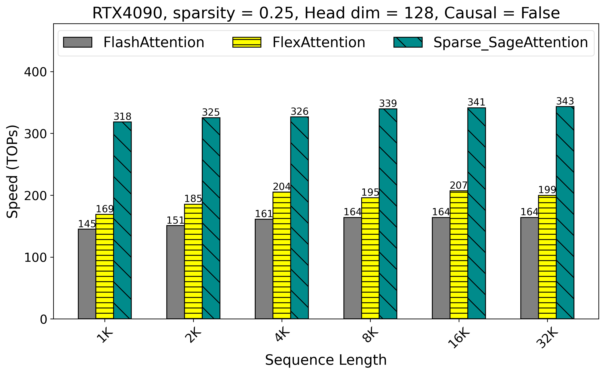
  </div>

  <!-- 第三行 -->
  <div style="flex: 1 1 45%; min-width: 300px;">
    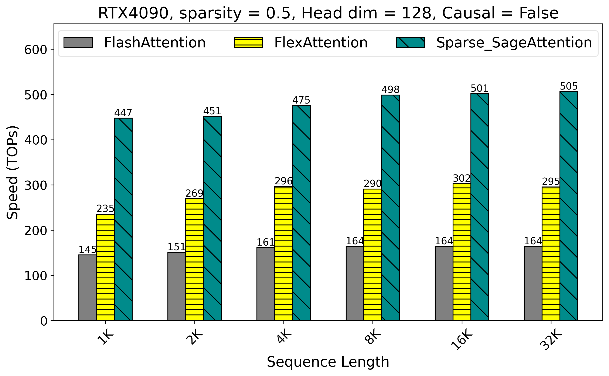
  </div>
  <div style="flex: 1 1 45%; min-width: 300px;">
    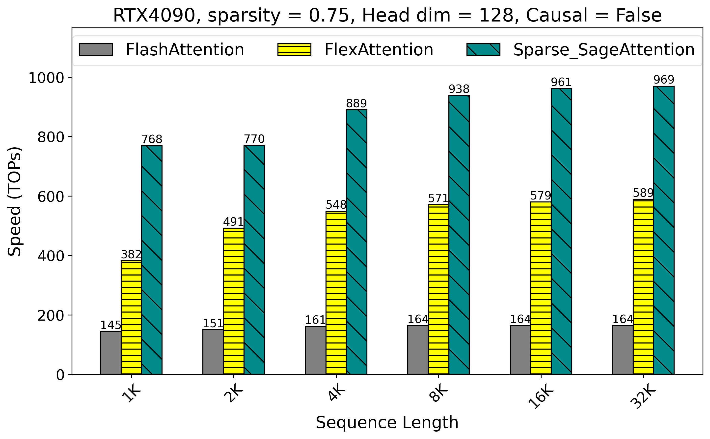
  </div>

  <!-- 第四行 -->
  <div style="flex: 1 1 45%; min-width: 300px;">
    
  </div>
  <div style="flex: 1 1 45%; min-width: 300px;">
    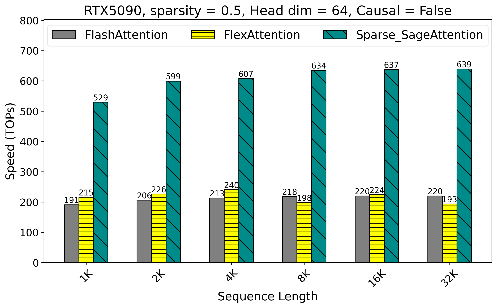
  </div>

  <!-- 第五行 -->
  <div style="flex: 1 1 45%; min-width: 300px;">
    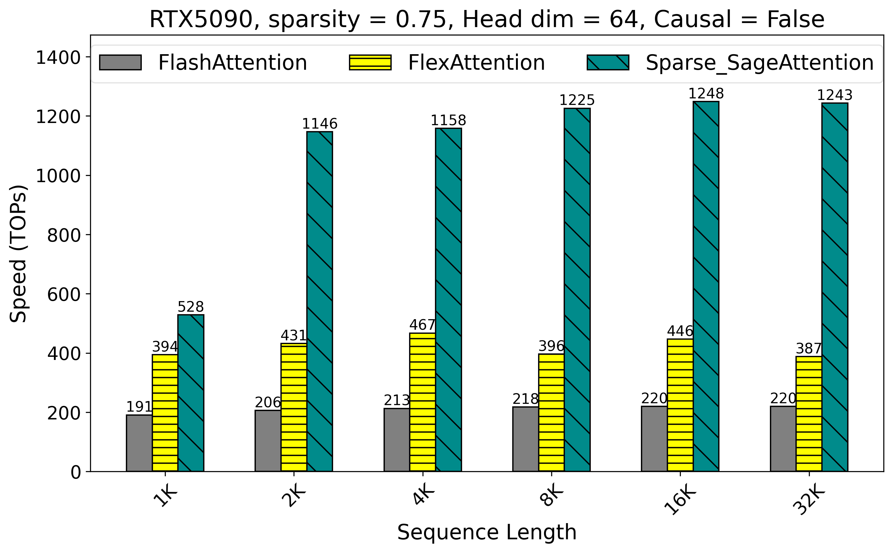
  </div>
  <div style="flex: 1 1 45%; min-width: 300px;">
    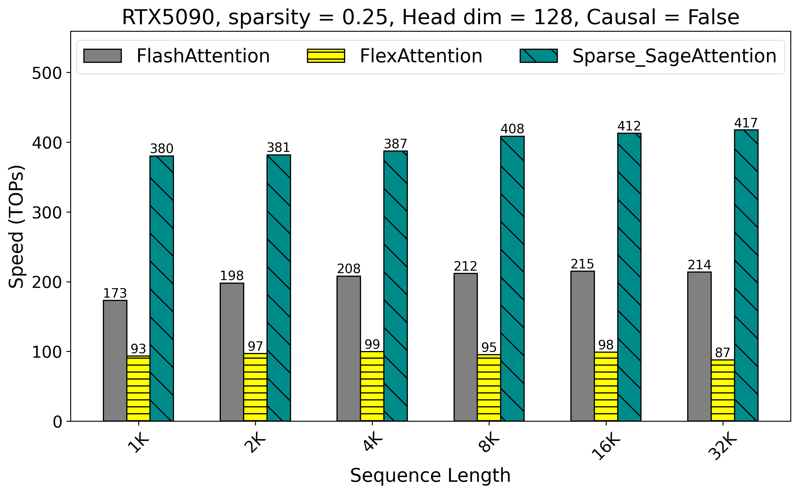
  </div>

  <!-- 第六行 -->
  <div style="flex: 1 1 45%; min-width: 300px;">
    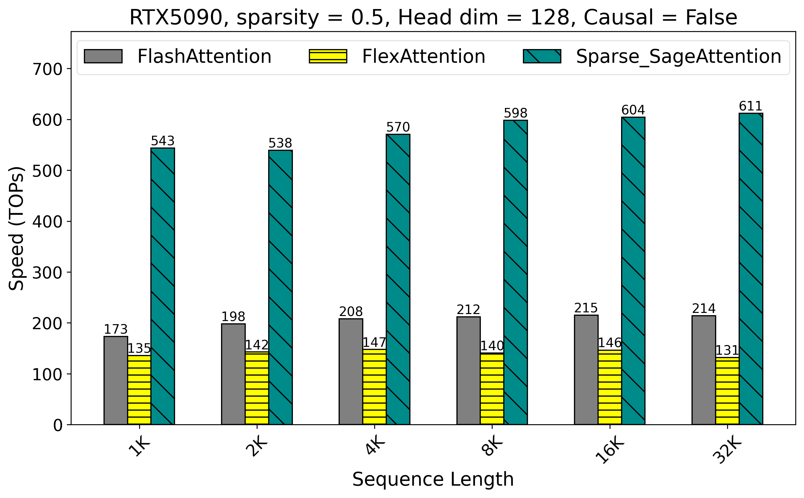
  </div>
  <div style="flex: 1 1 45%; min-width: 300px;">
    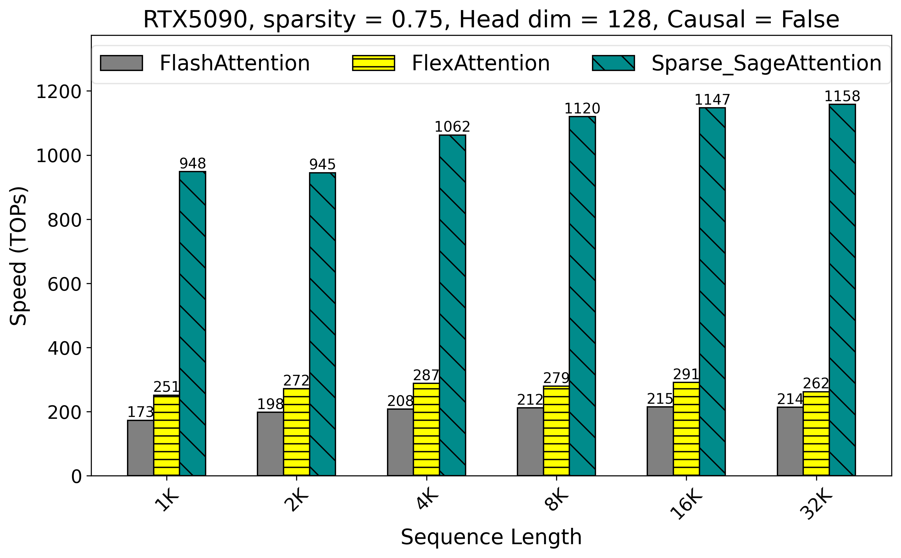
  </div>
</div>


## Citation
**If you use this code or find our work valuable, please cite:**
```
@inproceedings{zhang2025spargeattn,
  title={Spargeattn: Accurate sparse attention accelerating any model inference},
  author={Zhang, Jintao and Xiang, Chendong and Huang, Haofeng and Wei, Jia and Xi, Haocheng and Zhu, Jun and Chen, Jianfei},
  booktitle={International Conference on Machine Learning (ICML)},
  year={2025}
}

@inproceedings{zhang2025sageattention,
  title={SageAttention: Accurate 8-Bit Attention for Plug-and-play Inference Acceleration}, 
  author={Zhang, Jintao and Wei, Jia and Zhang, Pengle and Zhu, Jun and Chen, Jianfei},
  booktitle={International Conference on Learning Representations (ICLR)},
  year={2025}
}

@inproceedings{zhang2024sageattention2,
  title={Sageattention2: Efficient attention with thorough outlier smoothing and per-thread int4 quantization},
  author={Zhang, Jintao and Huang, Haofeng and Zhang, Pengle and Wei, Jia and Zhu, Jun and Chen, Jianfei},
  booktitle={International Conference on Machine Learning (ICML)},
  year={2025}
}

@article{zhang2025sageattention3,
  title={Sageattention3: Microscaling fp4 attention for inference and an exploration of 8-bit training},
  author={Zhang, Jintao and Wei, Jia and Zhang, Pengle and Xu, Xiaoming and Huang, Haofeng and Wang, Haoxu and Jiang, Kai and Zhu, Jun and Chen, Jianfei},
  journal={arXiv preprint arXiv:2505.11594},
  year={2025}
}
```